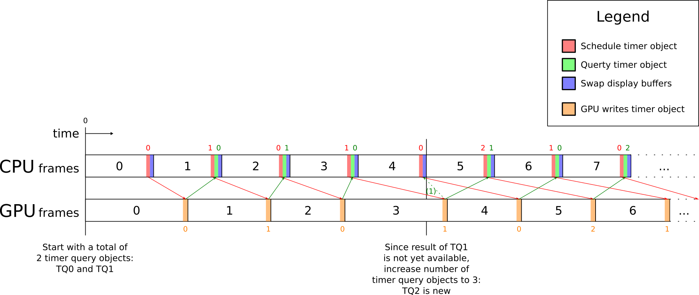

Description
===========

The goal of this utility is to find out
the worst case required number of OpenGL timer query objects scheduled simultaneously
to avoid pipeline stalls while querying the oldest timer query object.
We assume the timer queries are used to get
the absolute timestamp at the end of each frame of a given application/benchmark,
with the intent to do frame time analysis using the timestamps
(e.g., [libframetime](https://github.com/clbr/libframetime)).

Some say this number is equal to two (see [double timer query buffer approach](http://www.lighthouse3d.com/tutorials/opengl-timer-query/#highlighter_120514)),
but practice shows this is not high enough for some application - driver combinations.

This utility will dynamically increase the number of timer query objects
each time the oldest timer query result is not yet available,
while displaying a scene (currently a green screen) that asks little CPU time.
Below diagram tries to explain this process.

This diagram only shows one dynamic increase from two to three timer query objects for sake of simplicity,
but this process can go on until 255 timer query objects are used simultaneously.

General instructions (platform independent)
===========================================

Dependencies
------------

- `freeglut`

Building
--------

	mkdir build
	cd build
	cmake -DCMAKE_BUILD_TYPE=Release ..
	make

Running
-------

	./find-min-required-number-of-timer-queries    # with or without a ".exe" suffix

Example output
--------------

	GL_RENDERER           = Mesa DRI Intel(R) HD Graphics 530 (Skylake GT2) 
	GL_VERSION            = 3.0 Mesa 12.1.0-devel
	GL_VENDOR             = Intel Open Source Technology Center
	GL_QUERY_COUNTER_BITS = 36
	
	Initial number of timer queries: 2
	Buffer resize was needed at frame 0, updated number of timer queries: 3
	Buffer resize was needed at frame 1, updated number of timer queries: 4

After a while you can press ESC to stop the test.
The last line of output is the most interesting one, in this example the number of timer queries converged to **`4`**.

If you ever see a higher number, please open a GitHub issue on this project page with your full output attached, this would be interesting.
Disabling VSync can make it easier to get a high number, on Mesa prepend `vblank_mode=0 ` to the command line.

After some investigation, it seems this number is related to
the "maximum pre-rendered frames" setting for NVIDIA and "flip queue size" setting for AMD.

Cross compiling on Ubuntu 64-bit for **Win64**
==============================================

Dependencies
------------

- `mingw-w64`
- `g++-mingw-w64`
- `wine` (only for testing)

Building and installing freeglut
--------------------------------

	wget http://netix.dl.sourceforge.net/project/freeglut/freeglut/3.0.0/freeglut-3.0.0.tar.gz
	tar -zxvf freeglut-3.0.0.tar.gz
	cd freeglut-3.0.0
	mkdir build-cross-mingw64
	cd build-cross-mingw64
	cmake -DCMAKE_TOOLCHAIN_FILE=$(pwd)/../../CMake/Toolchain-Ubuntu-mingw64.cmake -DCMAKE_BUILD_TYPE=Release -DCMAKE_INSTALL_PREFIX=/usr/x86_64-w64-mingw32 ..
	make -j $(nproc)
	x86_64-w64-mingw32-strip --strip-unneeded bin/libfreeglut.dll    # optional, to make dll smaller
	sudo make install
	cd ../..

Building find-min-required-number-of-timer-queries
--------------------------------------------------

	mkdir build-cross-mingw64
	cd build-cross-mingw64
	cmake -DCMAKE_TOOLCHAIN_FILE=$(pwd)/../CMake/Toolchain-Ubuntu-mingw64.cmake -DCMAKE_BUILD_TYPE=Release ..
	make
	cp /usr/x86_64-w64-mingw32/bin/libfreeglut.dll .

Running
-------

	wine ./find-min-required-number-of-timer-queries.exe
